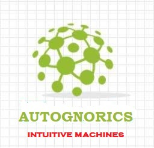

# ELFS: Engineered Life Forms
[HOME](https://autognorics.github.io/) 

Elfs or engineered life forms are living machines endowed with the six signatures of life. They are living machines classified as neural and aneural. They are classified as gnorics, biognorics, homognorics, and zoikrons. They are alive, aware, conscious, intuitive, self-knowledge, and living - the six marks of life or with life.

Joey Lawsin, author of Autognorics, redefined Alive or aliveness in his research as the ability of an organism to self-consume energy. This energy is provided by an external source. For example, an infant when guided accordingly gets his/her energy from his/her mother's milk. Mother is an external source. A machine, when guided, gets its energy from a charging station or a solar panel, another external source. In these examples, both the machine and baby are technically considered alive.

Meanwhile, Awareness is redefined based on two prerequisites. First, the object is alive, and second, the object is equipped with intuitive sensors. A newborn is aware because he/she consumes energy and his/her physical body is geared with standards sensors like the ears, eyes, nose, and skin as examples. However, surprisingly, these sensors function without the intervention of the brain at the early life stage of the baby. A machine is as well aware when it self-consumes energy and is automated with intuitive or wise sensors. The intuitive objects are triggered dimetrically by Inscription by Design. In these examples, the baby and the machine are alive and aware but not conscious, intuitive, self-knowledge, and living yet.

Consciousness, on the other, is redefined bound by three requirements, namely, aliveness, awareness, and codification. An object is conscious when it self-consumes energy, driven by sensors, and codifies things. Codification or codexation is the key factor in identifying when an object is conscious or not. Codexation is the self-ability of an organism to associate an object with another object unknowingly. In other words, a machine is conscious when it self-consumes energy, equipped with sensors, and matches objects. A baby, at a certain point in her/his early life, can stacks colorful bricks unknowingly without the help of the brain. This action shows that one can be alive, aware, and conscious even without the help of the brain. Here, the baby and the machine are alive, aware, and conscious, but not yet rational, neural, and living.

Intuitiveness or logic is redefined depending on four determinants: aliveness, awareness, consciousness, and intuitiveness. An object is logical when it self-consumes energy, driven by sensors, codifies things, and able to rational or choose. The self ability to choose is the key factor in identifying when an object is logical. This behavior is influenced by the Theory of the Second Option or the This or That Rule. The baby and the machine, in this case, are alive, aware, conscious, intuitive, but not yet neural, and living.

Neural is defined contingent on five benchmarks: aliveness, awareness, consciousness, intuitiveness, and selfness. An object is neural when it self-consumes energy, driven by sensors, codifies things, selects options, and self-knowledge. The self-ability to realize knowledge is the key mark that identifies when an object is neural. Gnomi ("Mindness") or the power of thoughts is classified as neural and aneural. In this scenario, the baby and the machine are alive, aware, conscious, intuitive, and aneural (a brain without the brain).

In summary, Life is defined based on one or all the following:

1. Aliveness
2. Awareness
3. Consciousness
4. Intuitiveness
5. Selfness
6. Lifeness

The four Marks of a Self-Living Machine.

1. It can transcodify abstracts to physicals; (the primary indicator of consciousness).
2. It can transform physicals into mechanical actions or movements; (inscription by design).
3. It can transfer motions into repetitive or autonomous actions; (intuitive objects)
4. It can translate the intuitive persona into social experiences; (feeling, thinking, behaving). 

> "Life is Chemistry not Biology." ~ Joey Lawsin
